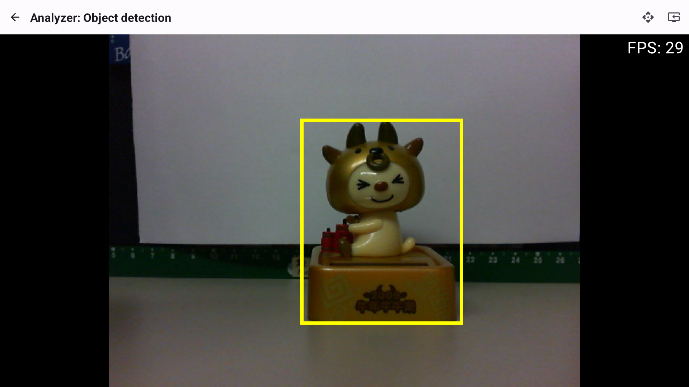
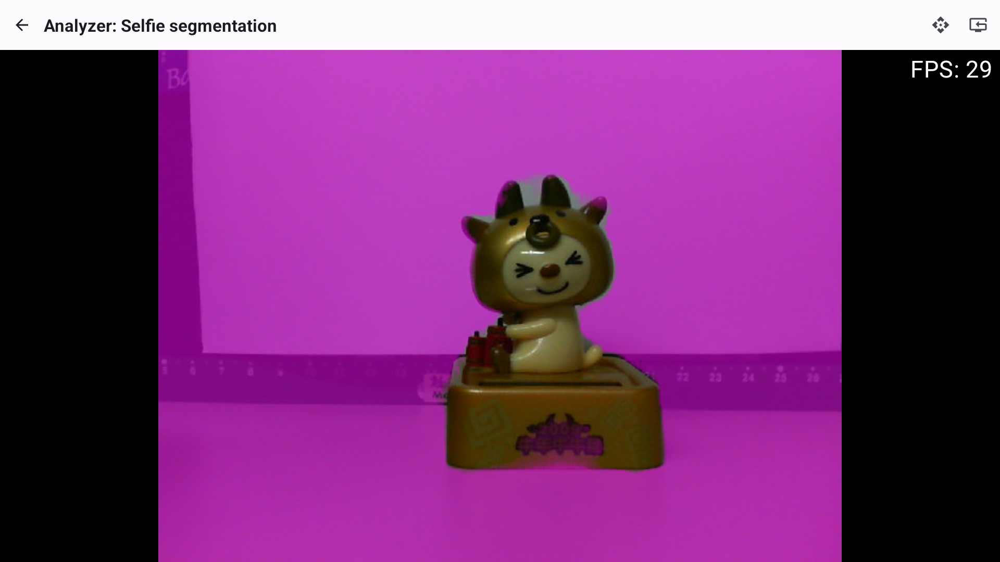

# UVC Cameras on Android with ML-Kit and Jetpack Compose

https://developers.google.com/ml-kit/guides

Use on-device machine learning in your apps to easily solve real-world problems.

ML Kit is a mobile SDK that brings Google's on-device machine learning expertise to Android and iOS apps. Use our powerful yet easy to use Vision and Natural Language APIs to solve common challenges in your apps or create brand-new user experiences. All are powered by Google's best-in-class ML models and offered to you at no cost.

# External USB Cameras 

https://source.android.com/docs/core/camera/external-usb-cameras

# ML-Kit in Jetpack Compose

https://github.com/chouaibMo/MLKit-Jetpack-Compose

# Basic functionality for UVC Cameras on Android with Kotlin and Jetpack Compose

https://github.com/shanerodrigues/compose-uvc-camera

# ML Kit Sample

BarCode: https://developers.google.com/ml-kit/vision/barcode-scanning/android?hl=en

Face: https://developers.google.com/ml-kit/vision/face-detection

FaceMesh: https://developers.google.com/ml-kit/vision/face-mesh-detection/android?hl=en

Text Recognition: https://developers.google.com/ml-kit/vision/text-recognition/v2/android?hl=en

Image Labeling/Custom: https://developers.google.com/ml-kit/vision/image-labeling/android?hl=en

ObjectDetection: https://developers.google.com/ml-kit/vision/object-detection/android

Pose Detection: https://developers.google.com/ml-kit/vision/pose-detection

Selfie Segmentation: https://developers.google.com/ml-kit/vision/selfie-segmentation/android

#  Machine learning models

https://www.kaggle.com/models?tfhub-redirect=true

# Reference Model for Image Labeling

2.tflite: https://www.kaggle.com/models/tensorflow/efficientnet 
Imagenet (ILSVRC-2012-CLS) classification with EfficientNet-B0.
efficientnet
tensorflow/efficientnet

# Screen Capture

 

 
